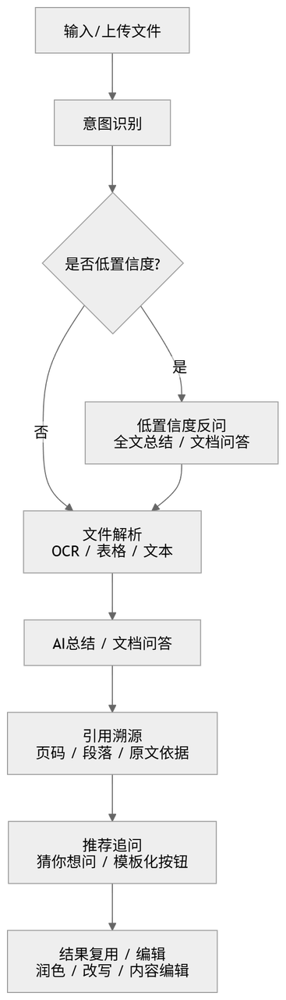

**智慧读文功能 PRD（评审优化版）**

嵌入现有AI入口｜意图识别｜文档总结｜文档问答｜模板化追问｜伪多轮交互

| **文档版本**  | V1.0 评审版                                    |
| --------- | ------------------------------------------- |
| **适用范围**  | PC端、粤政易端（移动端）智慧读文能力设计                       |
| **产品定位**  | 非独立系统；嵌入现有AI入口的文档理解能力增强模块                   |
| **核心能力**  | 文件上传与解析、意图识别与反问确认、全文总结、文档问答、引用溯源、模板化推荐追问    |
| **待确认事项** | 具体文件大小上限、现有OCR/表格解析工具能力、现有意图识别智能体接口与置信度返回方式 |

*评审关注点：本方案重点说明如何在现有AI体系中新增“智慧读文”分支，并通过模板化按钮解决算力受限下的伪多轮追问体验。*

# 1. 项目背景

## 1.1 目标：要解决什么问题

在日常办公场景中，用户需要高频处理政策文件、报告、会议材料、业务表格等长篇或复杂文档。传统人工阅读方式存在耗时长、重点提取困难、数据来源追溯效率低等问题。现有通用AI虽具备问答与总结能力，但用户往往不知道如何构造精准提示词，导致使用门槛较高。

本需求目标如下：

* 提升长文档阅读效率：将人工逐字阅读转化为结构化总结与重点提取。
* 降低AI使用门槛：通过默认总结Prompt和“猜你想问”按钮，让用户无需学习复杂Prompt。
* 提高回答可信度：在AI回答中展示原文引用位置，支持用户回溯核验。
* 适配算力约束：在不支持原生高级多轮自由问答的前提下，通过模板化按钮和上下文拼接实现“伪多轮”体验。

## 1.2 用户：使用对象及其需求

| **用户类型**   | **典型场景**             | **核心诉求**                       |
| ---------- | -------------------- | ------------------------------ |
| PC端办公人员    | 处理公文、报告、制度文件、项目材料    | 快速把握全文主旨、提取关键结论，并将结果流转至润色/编辑组件 |
| 粤政易端移动办公人员 | 在移动端临时查看政策文件、通知、会议材料 | 用对话式交互快速理解文档重点，支持快捷追问          |
| 业务人员       | 围绕文件内容查找某项数据、依据或观点来源 | 获得可追溯的回答，降低人工检索成本              |

## 1.3 痛点：之前靠什么方式解决，有哪些问题

当前用户主要依赖人工阅读、人工检索、复制文档内容后自行向通用AI提问等方式处理长文档。上述方式存在以下问题：

* 人工逐字阅读耗时较长，面对长篇报告、制度文件、政策文件时效率较低。
* 重点提取依赖个人经验，关键信息、结论和风险点容易遗漏。
* 数据、观点或依据的来源需要人工回查，追溯效率低。
* 通用AI能力需要用户自行组织提示词，普通用户难以稳定获得结构化、可引用的回答。
* 在算力不足或多轮问答能力受限的情况下，自由追问体验不稳定。

## 1.4 价值：为什么现在值得用AI做

智慧读文不是从0建设的独立产品，而是嵌入现有AI入口体系中的能力增强模块。用户可通过现有输入框、文件上传入口或AI助手入口触发该能力，无需切换至独立系统。

本次设计的核心不是新增一个独立AI产品，而是在现有AI入口和意图识别体系中新增“智慧读文”能力分支。用户上传文档或输入文档相关问题后，系统通过意图识别进入智慧读文智能体，完成文件解析、结构化总结、文档问答和引用溯源。针对当前算力资源不足、无法支持高级多轮自由问答的问题，方案采用模板化“猜你想问”按钮与上下文拼接机制，实现接近多轮追问的产品体验，同时降低用户Prompt使用门槛。

## 1.5 边界：什么做、什么不做

| **类别** | **说明**                                                                          |
| ------ | ------------------------------------------------------------------------------- |
| 做      | 支持文档上传与解析；支持智慧读文意图识别；支持低置信度反问确认；支持全文总结、文档问答、引用溯源；支持模板化推荐追问；PC端支持结果流转至已有编辑/润色能力。 |
| 不做     | 不做脱离文档内容的开放式闲聊；不做原生高级多轮自由问答；不替代人工业务决策或最终内容审核；不处理明确标识为机密级别的涉密文档。                 |

能力重点聚焦“基于用户上传文档”的总结、问答、引用溯源与后续加工，不承接开放式闲聊或脱离文档的泛化推理。

## 1.6 权限：功能权限、数据权限

| **类别** | **说明**                                                     |
| ------ | ---------------------------------------------------------- |
| 功能权限   | 拥有PC端和粤政易端系统账号的办公人员均可使用。                              |
| 数据权限   | 仅读取用户当前主动上传的文件作为上下文；问答记录默认仅当前用户可见。                    |
| 安全要求   | 上传侧提示严禁上传涉密文件；系统侧需遵循政务/企业数据安全规范，保留必要操作日志与异常日志。 |

# 2. 需求内容

## 2.1 业务流

### 2.1.1 用户具体主流程

1. 用户在PC端或粤政易端进入现有AI入口，可输入问题、上传文件，或二者同时进行。
2. 中枢意图识别智能体判断是否命中“智慧读文”意图。
3. 若判断明确，则进入智慧读文智能体；若判断不明确，则触发反问确认。
4. 系统按文件类型调用对应解析能力，包括文本解析、OCR识别、表格解析等。
5. AI根据用户意图执行全文总结或文档问答，并生成结构化结果与引用来源。
6. 系统在结果底部展示“猜你想问”模板按钮，用户点击后发起下一轮固化追问。
7. PC端可将AI结果继续流转到已有“润色”“AI改写”“内容编辑”等组件。

### 2.1.2 核心业务流程图

## 2.2 工作流

### 2.2.1 意图识别与反问确认

在现有中枢意图识别智能体中新增“智慧读文”分支。中枢智能体负责判断用户当前输入是否属于文档理解任务，并将用户查询词、文件对象、来源端、会话上下文摘要等必要信息透传给智慧读文智能体。

| **用户输入特征**                 | **是否有文件** | **判定结果**   | **处理方式**            |
| -------------------------- | --------- | ---------- | ------------------- |
| 仅上传文件，无文本指令                | 是         | 低置信度       | 触发反问确认：全文总结 / 文档问答  |
| “帮我总结/分析/提炼这篇文章”           | 是         | 智慧读文-全文总结  | 进入总结流程，使用默认总结Prompt |
| “这段话什么意思/某观点依据是什么/数据来源在哪里” | 是         | 智慧读文-文档问答  | 进入问答流程，检索文档片段并回答    |
| 上传PDF或扫描件，并询问内容            | 是         | 智慧读文-解析+问答 | 先OCR解析，再进入问答        |
| 无文件，仅普通聊天或常识问答             | 否         | 通用AI       | 进入原有通用AI分支          |
| 任务交办、下批示、任务问答等明确任务类指令      | 视情况       | 原有任务分支     | 保持现有分支逻辑，不抢占        |

低置信度反问机制如下：

* 触发条件：仅上传文件、用户指令含糊、智慧读文与其他分支置信度接近、文件上传但意图缺失。
* 反问形式：在对话流中展示确认气泡，提供“全文总结”“文档问答”等按钮。
* 交互原则：用户点击按钮后再进入对应流程，避免系统误判造成体验中断。
* 示例文案：检测到您上传了文件，请确认需要进行哪类操作？【全文总结】【文档问答】。

### 2.2.2 智慧读文智能体输入与输出

| **输入项** | **说明**                      | **示例**                     |
| ------- | --------------------------- | -------------------------- |
| 用户文本指令  | 用户主动输入的问题或操作意图              | 帮我总结这篇文章 / 这项数据来源在哪里       |
| 文件对象    | 用户上传的文档对象，包含文件ID、文件名、类型、大小等 | policy.pdf / document.docx |
| 按钮传参    | 用户点击“猜你想问”按钮后传入的固化指令        | 生成汇报话术 / 提取关键数据            |
| 上下文摘要   | 上一轮输入与AI结果的结构化摘要，用于伪多轮拼接    | 上一轮总结主题、关键结论、引用片段          |

| **输出项** | **说明**             | **呈现方式**              |
| ------- | ------------------ | --------------------- |
| 结构化富文本  | 包含标题、分点、结论、依据来源    | 对话气泡中的富文本卡片           |
| 引用标识    | 展示原文页码、段落或表格位置     | \[引用：第3段] / \[来源：第2页] |
| 猜你想问按钮  | 基于场景模板生成的下一步操作按钮   | 横向胶囊按钮                |
| 异常提示    | 解析失败、格式不支持、文件过大等提醒 | Toast / 对话气泡 / 弹窗     |

### 2.2.3 文件解析策略

| **文件类型**      | **处理策略**              | **能力边界/注意事项**      |
| ------------- | --------------------- | ------------------ |
| DOC/DOCX/TXT  | 直接提取文本内容，并保留标题层级、段落顺序 | 需处理空段、目录、页眉页脚等干扰信息 |
| PDF文本型        | 优先提取可复制文本；如失败再走OCR    | 需保留页码，便于引用回溯       |
| PDF扫描型/图片型PDF | 调用OCR识别文字             | 复杂版式、低清晰度图片会影响准确率  |
| 表格类文档/XLSX    | 调用表格解析工具，保留行列结构与表头    | 合并单元格、跨页表格可能导致结构异常 |
| 不支持格式         | 拦截并提示用户更换格式           | 提示支持格式清单           |

### 2.2.4 模板化追问与伪多轮机制

设计原则如下：

* 由于当前硬件算力资源不足，不做原生高级多轮自由问答。
* 推荐追问不完全依赖AI实时自由生成，而是基于场景模板进行固化配置。
* 用户点击按钮后，系统将上一轮摘要、当前按钮意图与文档片段拼接为新的完整Prompt。

| **场景**  | **推荐按钮**               | **拼接逻辑**                |
| ------- | ---------------------- | ----------------------- |
| 全文总结完成后 | 提取关键数据 / 生成汇报话术 / 继续追问 | 上一轮总结摘要 + 按钮指令 + 原文相关片段 |
| 文档问答完成后 | 查看依据 / 扩展解释 / 改写为正式表述  | 上一轮问答结果 + 按钮指令 + 引用片段   |
| 表格解析完成后 | 提取指标 / 生成表格摘要 / 找异常数据  | 表格结构信息 + 按钮指令 + 用户目标    |
| 低置信度反问后 | 全文总结 / 文档问答            | 用户选择结果作为意图补全信息          |

## 2.3 与其他智能体协同

### 2.3.1 中枢意图识别智能体协同

中枢意图识别智能体负责判断是否命中“智慧读文”意图，并在判断不明确时触发反问确认。若用户输入属于普通聊天、常识问答、任务交办、下批示或任务问答等明确任务类指令，则保持现有分支逻辑，不抢占。

### 2.3.2 智慧读文智能体协同

智慧读文智能体接收中枢透传的用户查询词、文件对象、来源端、会话上下文摘要等信息，负责完成文档解析、全文总结、文档问答、引用溯源和推荐追问。

### 2.3.3 既有编辑与润色能力协同

PC端总结或问答结果可继续流转到已有“润色”“AI改写”“内容编辑”等组件，支撑后续内容加工。移动端优先保证查看、总结、问答与快捷追问，复杂编辑能力可引导至PC端完成。

## 2.4 页面展示

### 2.4.1 设计原则

* 不盲目创新，优先对标用户已熟悉的主流C端AI产品对话流交互。
* PC端优先复用现有AI问答、编辑、润色组件；移动端保持粤政易现有视觉和交互规范。
* 结果展示强调“结构化、可引用、可继续操作”。

### 2.4.2 PC端交互

* 入口：在现有系统界面中展示AI助手/小机器人悬浮入口。
* 展开：点击入口后进入全屏或半屏对话界面，支持输入问题与上传文件。
* 结果：AI输出结构化富文本卡片，底部展示推荐追问按钮。
* 复用：总结或问答结果可一键进入已有“润色”“AI改写”“内容编辑”等组件。

### 2.4.3 粤政易端（移动端）交互

* 入口：基于粤政易现有工作台或AI能力入口进入。
* 展示：沿用移动端对话流，文件卡片、用户气泡、AI回答气泡纵向排列。
* 操作：在AI回答底部展示横向滑动的快捷追问按钮。
* 限制：移动端优先保证查看、总结、问答与快捷追问，复杂编辑能力可引导至PC端完成。

### 2.4.4 输出格式规范

| **内容类型** | **展示规范**                                  |
| -------- | ----------------------------------------- |
| 全文总结     | 采用“一、文档主旨 / 二、核心观点 / 三、关键结论 / 四、风险与建议”等结构 |
| 文档问答     | 先给直接结论，再给依据说明，最后标注引用来源                    |
| 引用展示     | 以角标或蓝色标签展示，如\[引用：第3段]、\[来源：第2页]           |
| 按钮展示     | AI回答气泡底部横向展示胶囊按钮，点击即触发下一轮固化追问             |

## 2.5 配套功能说明

### 2.5.1 异常处理与提示文案

| **异常场景** | **触发条件**    | **提示文案建议**                       | **后续操作** |
| -------- | ----------- | -------------------------------- | -------- |
| 文件过大     | 超过系统限制      | 当前文件超过上传大小限制，请压缩或拆分后重新上传。        | 阻断上传     |
| 格式不支持    | 非支持格式       | 暂不支持该文件格式，请上传PDF、DOCX、TXT或表格类文件。 | 阻断并提示格式  |
| 解析失败     | OCR/文本提取失败  | 文档解析失败，请检查文件是否损坏或更换清晰版本后重试。      | 允许重试     |
| 意图不明确    | 仅上传文件或指令含糊  | 检测到您上传了文件，请确认需要进行全文总结还是文档问答。     | 展示反问按钮   |
| 回答无依据    | 文档中未检索到相关内容 | 未在当前文档中找到明确依据，建议换一种问法或补充文件。      | 给出兜底回答   |
| 网络/模型超时  | 服务调用超时      | 当前服务响应超时，请稍后重试。                  | 允许重试     |

### 2.5.2 待确认问题清单

| **问题**                             | **需确认对象**  | **影响范围**        |
| ---------------------------------- | ---------- | --------------- |
| 现有意图识别智能体如何搭建，是否返回置信度及候选分支？        | 大川/算法或平台同事 | 决定低置信度反问机制如何接入  |
| 当前可调用哪些OCR、表格解析、文本抽取工具？支持格式和限制是什么？ | 大川/平台同事    | 决定文件解析能力边界与异常提示 |
| PC端具体挂载入口位置及是否复用已有AI助手组件？          | 产品/前端      | 决定页面原型与交互成本     |
| 粤政易端上传文件能力、文件大小和权限限制？              | 移动端/平台同事   | 决定移动端能力范围       |
| AI输出结果是否需要落库，历史记录保留多久？             | 安全/后端      | 决定数据治理与合规策略     |

## 2.6 知识库构建（如有）

### 2.6.1 长文档处理与知识库临时切片

* 对超出模型上下文窗口的长文档进行临时切片处理，按标题、段落、页码或表格边界进行Chunk拆分。
* 每个Chunk需保留来源信息，如文件名、页码、段落序号、表格编号，便于回答时引用。
* 文档切片仅在当前会话或本次任务中临时使用，不默认沉淀为长期知识库。

### 2.6.2 知识库边界

本功能不默认构建长期知识库。文档切片仅作为当前会话或本次任务的临时上下文，用于支撑总结、问答、引用溯源和模板化追问。

## 2.7 数据治理（数据集构建）（如有）

### 2.7.1 数据使用范围

* 系统仅读取用户当前主动上传的文件作为上下文。
* 问答记录默认仅当前用户可见。
* 文档切片仅在当前会话或本次任务中临时使用，不默认沉淀为长期知识库。

### 2.7.2 数据安全要求

* 上传侧提示严禁上传涉密文件。
* 系统侧需遵循政务/企业数据安全规范。
* 系统需保留必要操作日志与异常日志。
* 明确标识为机密级别的涉密文档不在本功能处理范围内。

### 2.7.3 数据治理待确认项

AI输出结果是否需要落库、历史记录保留多久，需由安全/后端进一步确认。该事项将影响数据治理与合规策略。

# 3. 验收指标

| **指标类别** | **指标名称**  | **建议口径**                             |
| -------- | --------- | ------------------------------------ |
| 功能达标     | 全链路跑通率    | PC端与粤政易端均能跑通“上传文件 → 总结 → 问答 → 追问”主链路 |
| 意图识别     | 智慧读文命中率   | 明确文档总结/问答场景下成功命中智慧读文分支               |
| 兜底机制     | 低置信度反问成功率 | 意图不明时能正确触发反问，并根据用户选择进入对应流程           |
| 解析质量     | 文件解析成功率   | PDF、Word、表格等典型文件可成功提取主要内容            |
| 回答质量     | 引用覆盖率     | 涉及文档依据的回答应尽量给出段落、页码或表格来源             |
| 交互效果     | 推荐按钮点击率   | 衡量“猜你想问”模板按钮对伪多轮追问的引导效果              |
| 体验指标     | 首轮结果生成时长  | 在约定文件大小和页数范围内，结果生成耗时满足业务可接受水平        |
